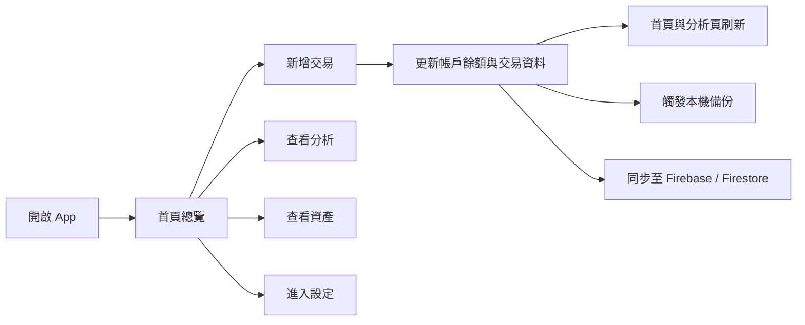
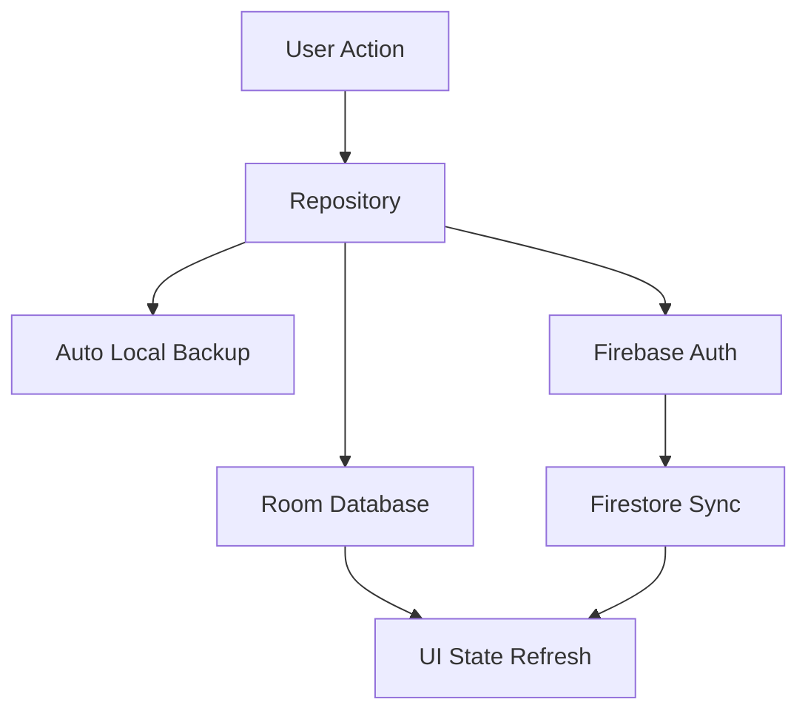

# CocoCoin

<p align="center">
  
</p>

<div align="center">
  <h1>CocoCoin</h1>
  <p>一款溫和、清楚、以本機優先為核心的 Android 個人記帳 App。</p>
  <p>它把日常收支、資產管理、預算感知、分析視覺化與雲端備份整合成一條完整體驗。</p>
</div>

<p align="center">
  
  
  
  
</p>

## Overview

CocoCoin 是一個原生 Android 記帳專案，重點不是只做出「能新增一筆資料」的 demo，而是把記帳 App 真正會需要的幾個核心環節串起來：

- 日常收支輸入
- 多帳戶資產管理
- 月預算追蹤
- 圖表分析與分類洞察
- JSON / CSV 匯出
- Firebase 同步與備份

如果你想找的是一個可以拿來當作品集、專題基底，或練習 Kotlin + Room + Firebase 的完整 app，這個 repo 會比一般教學型範例更接近真實產品。

## Highlights

| 模組 | 說明 |
| --- | --- |
| `Home` | 顯示當月收支、預算進度與交易列表 |
| `Analysis` | 透過圖表與分類明細分析消費結構 |
| `Add Transaction` | 快速新增收入與支出 |
| `Assets` | 管理帳戶餘額與整體資產 |
| `Settings` | 備份、同步、登入綁定、匯出與分類管理 |

## Feature Snapshot

<p align="center">
  
  
  
</p>

<table>
  <tr>
    <td width="33%" align="center"><strong>快速記帳</strong><br />收入、支出、帳戶與分類一起管理</td>
    <td width="33%" align="center"><strong>分析洞察</strong><br />透過圖表和分類看懂花費結構</td>
    <td width="33%" align="center"><strong>同步備份</strong><br />本機優先，同時具備匯出與雲端備援</td>
  </tr>
</table>

## Core Features

### 1. Daily Bookkeeping

- 新增、編輯、刪除收入與支出
- 顯示交易時間、分類、帳戶與備註
- 支出時自動檢查帳戶餘額

### 2. Asset Tracking

- 建立多個資產帳戶
- 追蹤各帳戶目前餘額
- 支援帳戶新增、編輯與刪除

### 3. Budget Control

- 設定每月預算
- 在首頁顯示預算使用率
- 快速知道本月剩餘可支配空間

### 4. Insights and Analysis

- 依分類查看收支分布
- 透過圖表呈現消費比例
- 依日期與分類展開明細

### 5. Backup and Sync

- Room 作為本機主要資料來源
- Firebase Authentication 建立登入狀態
- Firestore 儲存雲端備份
- 支援 JSON 匯出、CSV 匯出與自動本機備份

> CocoCoin 的核心價值不是只有「記帳」，而是讓輸入、整理、分析與保留資料這整條流程都足夠順手。

## User Flow



## Data Strategy



## Experience Map

| 使用情境 | 使用者得到的回饋 |
| --- | --- |
| 記下一筆午餐支出 | 交易被保存、帳戶餘額更新、首頁資料刷新 |
| 想知道本月花最多在哪 | Analysis 頁用圖表與分類明細快速回答 |
| 想確認自己有沒有超出預算 | Home 頁直接看到預算進度與剩餘比例 |
| 換手機或怕資料遺失 | 可透過同步、JSON 匯出與本機備份提高安全感 |

## Tech Stack

| 類別 | 技術 |
| --- | --- |
| Language | Kotlin |
| UI | Android Views + Material Components |
| Architecture | Single Activity + Multiple Fragments |
| Local Storage | Room |
| Cloud | Firebase Authentication, Firestore |
| Charts | MPAndroidChart |
| Async | Kotlin Coroutines |
| Build | Gradle Kotlin DSL |

## Project Structure

```text
CocoCoin/
├── app/                       Android app 原始碼與資源
├── docs/                      專案分析文件與說明產物
├── design/                    設計相關資料
├── tools/                     產生文件或視覺輔助腳本
├── topic-arch-v5-redesign/    簡報或展示素材來源
├── build.gradle.kts           Root Gradle 設定
└── RELEASE_CHECKLIST.md       上線前檢查清單
```

## Main Screens

| Screen | 對應檔案 | 說明 |
| --- | --- | --- |
| Home | `HomeFragment` | 收支概覽、預算進度、交易清單 |
| Analysis | `AnalysisFragment` | 分類統計、圖表、明細 |
| Add Transaction | `AddTransactionFragment` | 新增收入與支出 |
| Assets | `AssetsFragment` | 管理帳戶與預算 |
| Settings | `SettingsFragment` | 備份、登入、同步、分類管理 |

## Local-First Sync Model

- 本機資料以 Room 為主
- App 啟動時會初始化 Firebase
- 若沒有正式登入，會先走匿名登入
- 雲端資料寫入 `users/{uid}/device_backups/{deviceId}`
- 每次核心資料更新後，可進一步同步雲端並觸發本機備份

## Getting Started

### Environment

- Android Studio
- JDK 17
- Android SDK 34
- Gradle Wrapper

### Run Locally

```bash
git clone git@github.com:Eleanoree/CocoCoin.git
cd CocoCoin
```

1. 用 Android Studio 開啟專案
2. 等待 Gradle Sync 完成
3. 準備 Firebase 設定
4. 啟動模擬器或實機執行

## Firebase Setup

為了避免把敏感設定直接推上 GitHub，以下檔案已忽略：

- `app/google-services.json`
- `app/src/main/res/values/firebase_config.xml`

你可以擇一啟用 Firebase：

1. 放入自己的 `app/google-services.json`
2. 或手動建立 `app/src/main/res/values/firebase_config.xml`

至少需要在 Firebase Console 啟用：

- `Authentication > Anonymous`
- `Firestore Database`

若後續要完整支援 Google / Email 登入，也需要開啟對應 Sign-in method。

## Validation Checklist

- 可正常新增帳戶
- 可新增、編輯、刪除交易
- 重啟 App 後資料仍保留
- 設定頁可顯示同步狀態
- JSON 匯出 / 匯入正常
- CSV 匯出正常
- 自動本機備份可運作

## Development Roadmap

### Near Term

- [ ] 補上實機畫面截圖與 README 展示圖
- [ ] 補上 `LICENSE`
- [ ] 整理版本號、App 名稱與商店描述
- [ ] 補齊基本單元測試

### Product Improvements

- [ ] Google / Email 正式登入流程優化
- [ ] 雲端還原與跨裝置資料整合體驗
- [ ] 類別與帳戶的更完整統計頁
- [ ] 深色模式與主題色系整理
- [ ] 匯率、多幣別或進階資產類型

### Engineering Improvements

- [ ] 導入更明確的 UI state / event 結構
- [ ] 增加 repository 與 sync 流程測試
- [ ] 拆分較大型 fragment / repository 檔案
- [ ] 建立 CI 檢查流程

## README Upgrade Ideas

如果你要把這個 repo 做成更完整的作品集，下一步很值得補：

- 實機截圖四宮格
- 30 秒 Demo GIF
- Banner 上再疊一版 App 真實畫面 mockup
- Firebase 架構圖
- 使用情境故事
- 測試策略與技術挑戰拆解

## License

目前尚未提供授權條款；若要公開發佈，建議補上 `LICENSE` 檔案。
